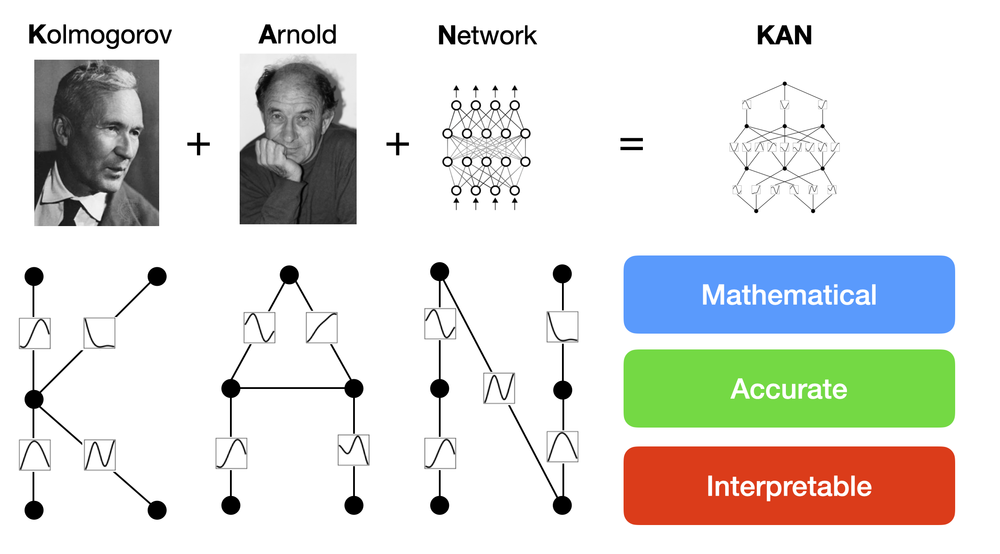

# Improving Computational Efficiency in Neural Network using Kolmogorov-Arnold Network(KAN)

This project explores how variants of **Kolmogorov-Arnold Networks (KAN)** perform on image classification tasks compared to traditional **Multi-Layer Perceptrons (MLP)**. We evaluate both models on benchmark image datasets and analyze their effectiveness in feature learning and classification accuracy.

---

## 🧠 Motivation

KANs offer a novel architecture inspired by the **Kolmogorov–Arnold representation theorem**, which suggests that any multivariate continuous function can be represented using a finite sum of univariate functions. This theoretical framework allows KANs to learn expressive, adaptive transformations that may outperform standard MLPs, especially on high-dimensional structured data like images.

  

---

## 🚀 Features

- 🔍 Uses **ViT-DINOv2** extracted features
- 🔧 Evaluates **6 KAN variants** + MLP baseline:
  - EfficientKAN
  - FastKAN
  - ChebyKAN
  - JacobiKAN
  - RBFKAN
  - MLP
- 🔢 Compares with **Traditional ML models**:
  - Logistic Regression, Random Forest, SVM, XGBoost, etc.
- 📊 Evaluation Metrics:
  - Accuracy, Precision, Recall, F1 Score
  - AUC, Balanced Accuracy, Average Precision
  - Confusion Matrix
- ⚙️ Hyperparameter tuning with `Optuna` and PyTorch Lightning

---

## 🗂️ Project Structure

## 🧠 Model Comparison: KAN Variants vs MLP

Below is a summary of the differences between the baseline MLP and various KAN-based architectures used in this project:

| Model         | Basis Function Type          | Param Efficiency | Training Speed | Interpretability | Notes                            |
|---------------|------------------------------|------------------|----------------|------------------|----------------------------------|
| `mlp`         | Linear layers + ReLU         | Baseline         | Fast           | Low              | Standard fully connected network |
| `efficient-kan` | Optimized adaptive splines   | High             | Moderate       | High             | Memory-efficient spline KAN      |
| `FastKAN`     | Low-rank + interpolation      | **Very High**    | **Fastest**    | Medium           | Designed for speed and scaling   |
| `ChebyKAN`    | Chebyshev polynomial basis    | Medium           | Moderate       | High             | Strong approximation properties  |
| `JacobiKAN`   | Jacobi polynomial basis       | Medium           | Slower         | High             | Generalizes Chebyshev basis      |
| `RBFKAN`      | Radial Basis Functions (RBF)  | Medium           | Moderate       | Medium           | Good for local approximations    |

### 🔑 Key Highlights

- **Param Efficiency**: How compact the model is while maintaining performance.
- **Training Speed**: Relative training speed under identical setups.
- **Interpretability**: Ease of visualizing and understanding internal mechanics.

> Each KAN variant represents a unique perspective on how to learn complex functions using simple, interpretable, univariate transformations.
